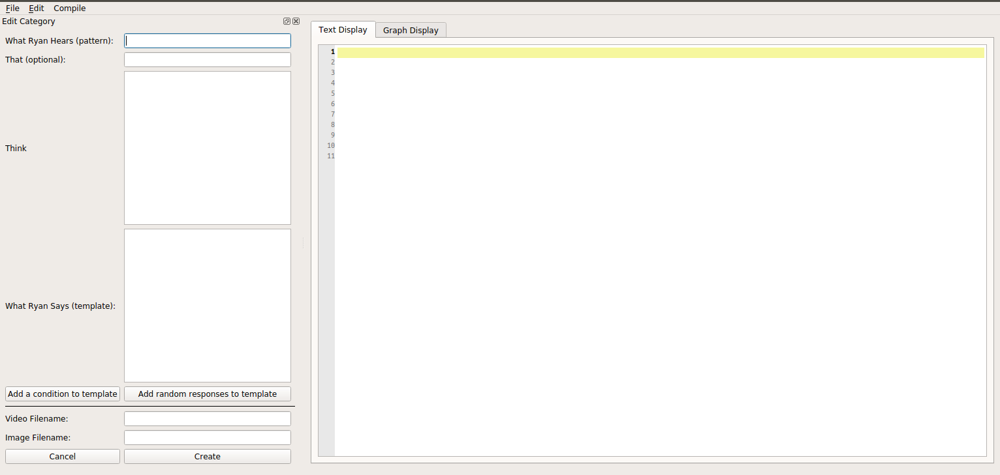

# AIMLEditor
A graphical AIML editor written in python 3 and pyqt5. This editor is used to create files that work with a custom AIML parser, Program-R, found here: https://github.com/roholazandie/program-r


AIML is a markup language used to create chatbots created by [Richard Wallace](https://en.wikipedia.org/wiki/Richard_Wallace_(scientist)). You can find his paper on AIML [here](https://freeshell.de/~chali/programowanie/Anatomy_of_ALICE.pdf) for a better understanding of the language.

# GUI
The editor has 2 different displays.
- A text edit display akin to notepad++.
- A graphical view to display conversation flow (coming soon).
    - The Node Editor for the graph view is borrowed from [here](https://gitlab.com/pavel.krupala/pyqt-node-editor-tutorials).

Once you hit the "Create" button, a Category tag will be generated with the text in the fields on the left.




# Notes about the Project

## To Run the Project
- Simply run the following command in the root directory: 
    ```
    python main.py
    ``` 

## To Run Test Cases
- Make sure you are inside of the Tests directory.
- From there run:
    ```
    python -m unittest -v test_cases.py
    ```

## To Compile to an Executable
- Install pyinstaller with:
    ```
    pip install pyinstaller
    ```
    - Documentation for pyinstaller can be found [here](https://www.pyinstaller.org/).
- In the root directory run:

    Linux
    ```
    pyinstaller main.py
    ```
    - This will create a dist folder that will contain a .dat file (an linux executable file).

    Windows
    ```
    pyinstaller -F --noconsole main.py
    ```
    - A dist folder will be created but will only contain a file named 'main.exe'.
    

# Using the Editor
- Any time a change is made to the editspace be sure to compile to properly save what you are showing on screen.
- The tabs labeled as "Text Display" and "Graph Display" will turn red when changes are made indicating you need to compile the code.
- Once the code has been properly compiled the tabs will be reset to their normal color.
- A popup window will appear if you have not compiled your code before you try to export.
- All categories created using the input fields will be placed at the bottom of the file inbetween the main \<aiml\> tags.
- An example of a workflow might look like this:
    1. Create a category using the fields on the left. 
    2. Compile.
    3. Make edits by manually typing on the edit space.
    4. Compile.
    5. Make another category.
    6. Compile.
    7. Export.
- Or if you want to use a previous file that you have created:
    1. Import.
    2. Compile.
    3. Create category using fields/manual edits.
    4. Compile.
    5. Export.
- When exporting to a file DO NOT add the .aiml to the end of your filename. That will be added automatically.
- Importing a file will overwrite whatever is currently on the edit space.

## Useful Shortcut Commands
- Ctrl + Shift + I - Imports a file
- Ctrl + Shift + E - Exports a file
- Ctrl + Shift + C - Compiles what is on screen
- Ctrl + F - Displays window that allows you to find and replace words in the edit space.